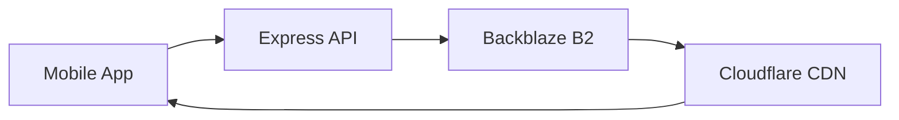

# 🎵 Napstr Player

A modern, feature-rich music streaming application built with React Native and Expo, showcasing advanced mobile development practices and cloud infrastructure integration.


## 🌟 Key Features

- **Seamless Music Streaming**: High-quality audio streaming with advanced playback controls
- **Beautiful Native UI**: Polished, responsive interface with smooth animations using React Native Reanimated
- **Smart Queue Management**: Intelligent queue handling with shuffle and repeat modes
- **Offline Support**: Download tracks for offline playback
- **Social Features**: Share music and interact with other users
- **Cross-Platform**: Works on both iOS and Android

## 🏗️ Technical Architecture

### Frontend (Mobile App)
- **Framework**: React Native with Expo
- **State Management**: React Context API with custom hooks
- **UI Components**: 
  - Custom-built components with TypeScript
  - React Native Reanimated for smooth animations
  - Gesture Handler for interactive elements
- **Audio Engine**: React Native Track Player
- **Performance Optimizations**:
  - Virtualized lists with FlashList
  - Efficient context updates
  - Optimized image loading

### Backend Infrastructure
- **API Server**: 
  - Express.js running on VPS
  - RESTful endpoints for music metadata and user data
  - WebSocket integration for real-time features

### Cloud Storage & CDN Architecture
- **Storage**: Backblaze B2 for cost-effective music file storage
- **CDN Integration**:
  - Cloudflare CDN with Bandwidth Alliance
  - Zero-cost data transfer through Backblaze B2 partnership
  - Custom domain with SSL for secure streaming
- **Optimization**:
  - Automatic audio format optimization
  - Smart caching strategies
  - Reduced latency through edge locations

## 💻 Technical Stack

```typescript
// Modern TypeScript with strict typing
interface AudioTrack {
  id: string;
  url: string;
  title: string;
  artist: string;
  artwork: string;
}

// Context-based state management
const PlayerContext = createContext<PlayerContextType>(null);

// Reanimated animations for smooth UI
const animatedStyle = useAnimatedStyle(() => ({
  transform: [{ scale: withSpring(scale.value) }]
}));
```

### Key Technologies
- React Native & Expo
- TypeScript
- React Native Reanimated
- React Native Track Player
- Express.js
- WebSocket
- Backblaze B2
- Cloudflare CDN

## 🚀 Performance Features

- **Efficient Data Loading**:
  - Lazy loading of audio tracks
  - Progressive image loading
  - Virtualized lists for smooth scrolling

- **State Management**:
  - Optimized context updates
  - Memoized callbacks
  - Efficient reducer patterns

- **Network Optimization**:
  - Smart caching strategies
  - Bandwidth-aware streaming
  - Compressed assets


## 🎯 Development Practices

- Strong TypeScript typing
- Comprehensive documentation
- Unit and integration testing
- CI/CD pipeline
- Code quality tools (ESLint, Prettier)

## 📱 App Architecture

```
src/
├── app/                    # Expo Router pages
├── components/             # Reusable UI components
├── contexts/              # Global state management
├── services/              # API and player services
├── utils/                 # Helper functions
└── constants/             # App-wide constants
```

## 🌐 Cloud Infrastructure



## 🛠️ Getting Started

### Prerequisites

- Node.js (v16 or newer)
- Yarn package manager
- Expo CLI (`npm install -g expo-cli`)
- iOS Simulator (for Mac users) or Android Studio (for Android development)
- Expo Go app on your physical device (optional, for testing)

### Environment Setup

1. Create a `.env` file in the root directory:
```bash
EXPO_PUBLIC_API_URL=your_api_url
EXPO_PUBLIC_CLOUDFLARE_DOMAIN=your_cloudflare_domain
```

### Installation

```bash
# Clone the repository
git clone https://github.com/yourusername/napstr-player.git

# Navigate to project directory
cd napstr-player

# Install dependencies
yarn install

# Install iOS pods (macOS only)
cd ios && pod install && cd ..
```

### Development

```bash
# Start Expo development server
yarn start

# Run on iOS (macOS only)
yarn ios

# Run on Android
yarn android

# Run on web
yarn web
```

### Running on Physical Device

1. Install Expo Go app from App Store (iOS) or Play Store (Android)
2. Scan the QR code shown in terminal after `yarn start`
3. The app will load on your device

### Common Issues

- If you encounter any build errors, try:
  ```bash
  expo doctor
  ```
  This will check your development environment and fix common issues.

- For iOS build issues:
  ```bash
  cd ios
  pod install
  cd ..
  ```

- For Android build issues:
  ```bash
  cd android
  ./gradlew clean
  cd ..
  ```

### Production Build

```bash
# Build for iOS
eas build --platform ios

# Build for Android
eas build --platform android
```


## 📄 License

This project is licensed under the MIT License - see the [LICENSE](LICENSE) file for details.

---
